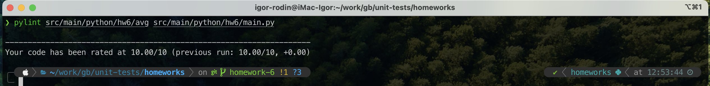

# Unit-тесты (семинары)

## Урок 6. Юнит тестирование в других языках

### Задание - Создайте программу на Python или Java, которая принимает два списка чисел и выполняет следующие действия:

1. Рассчитывает среднее значение каждого списка.
2. Сравнивает эти средние значения и выводит соответствующее сообщение:

- "Первый список имеет большее среднее значение", если среднее значение первого списка больше.
- "Второй список имеет большее среднее значение", если среднее значение второго списка больше.
- "Средние значения равны", если средние значения списков равны.

Код программы на python - ```src/main/python/hw6```

- Отчет pylint

```commandline
pylint src/main/python/hw6/avg src/main/python/hw6/main.py
```



- Отчет pytest о покрытии тестами

```commandline
python3 -m pytest -vv --cov=src/main/python/hw6/avg --cov-branch src/main/python/hw6 
```


Тестами покрыты сценарии:

- среднее значение списка корректно рассчитывается;
- если метод _avg_ на вход получает не список выбрасывается исключение _TypeError_;
- если метод _avg_ на вход получает пустой список выбрасывается исключение _ValueError_ (среднее значение от пустого
  списка не имеет смысла);
- средние значения двух списков корректно сравниваются;
- если метод _compare_avg_arr_ на вход получает не списки или пустые выбрасывается исключение _CalcCompareAvgError_.
